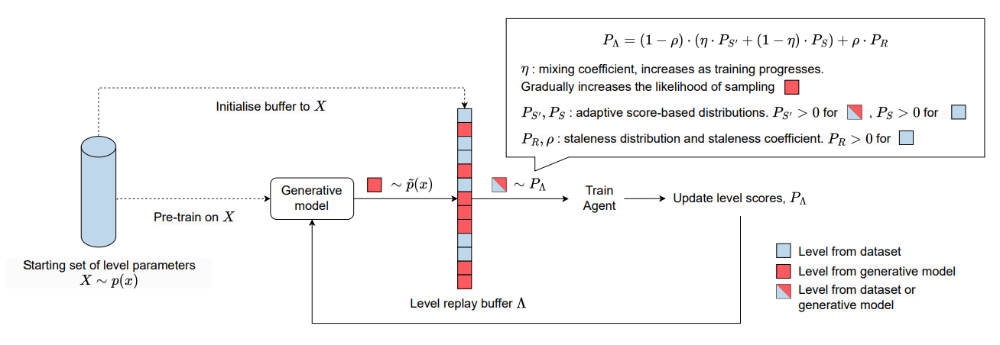
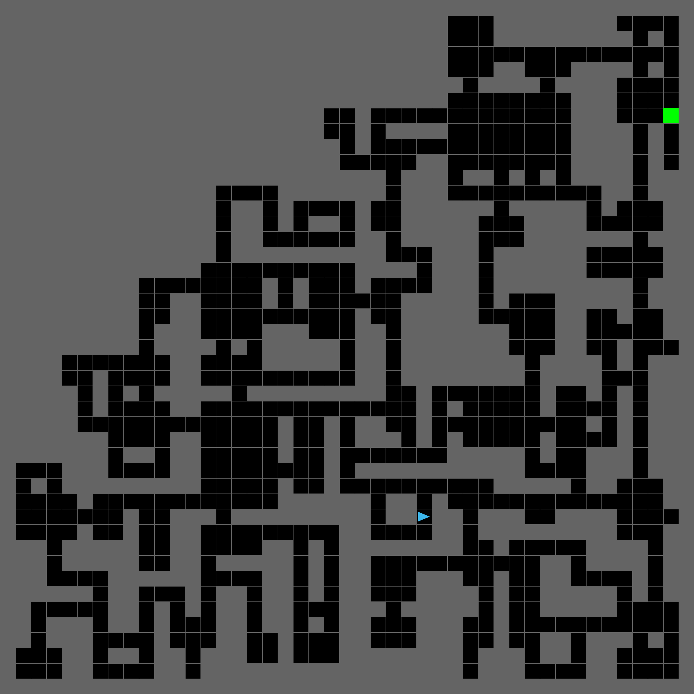
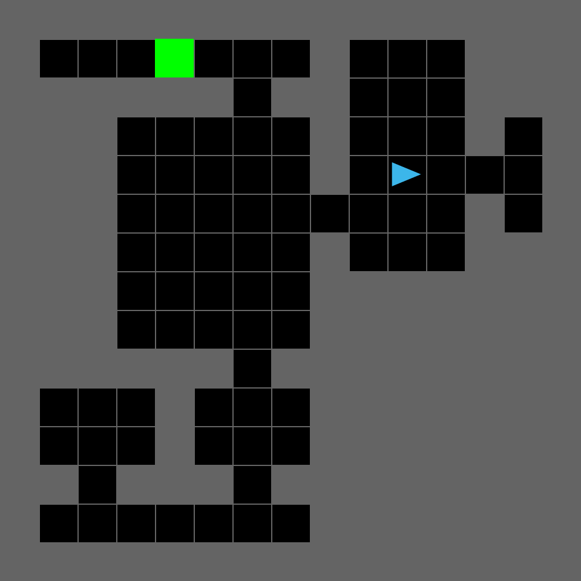
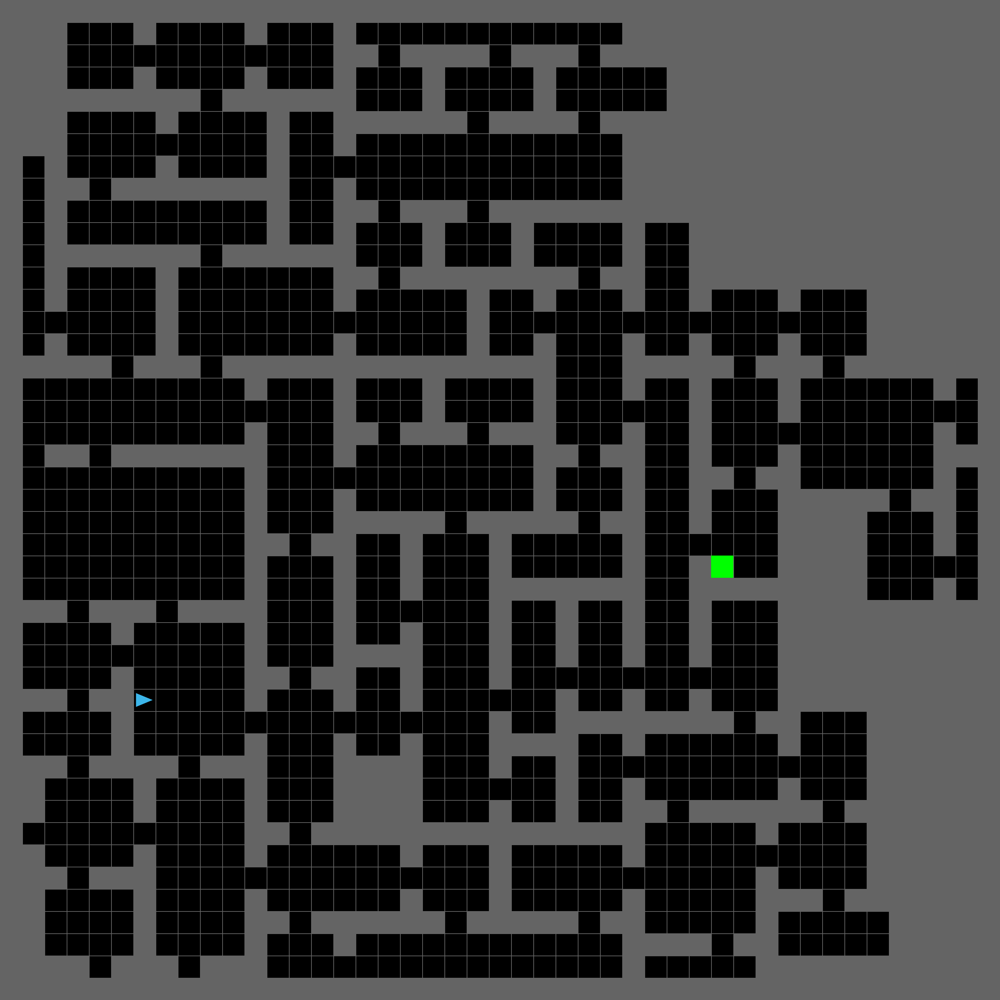
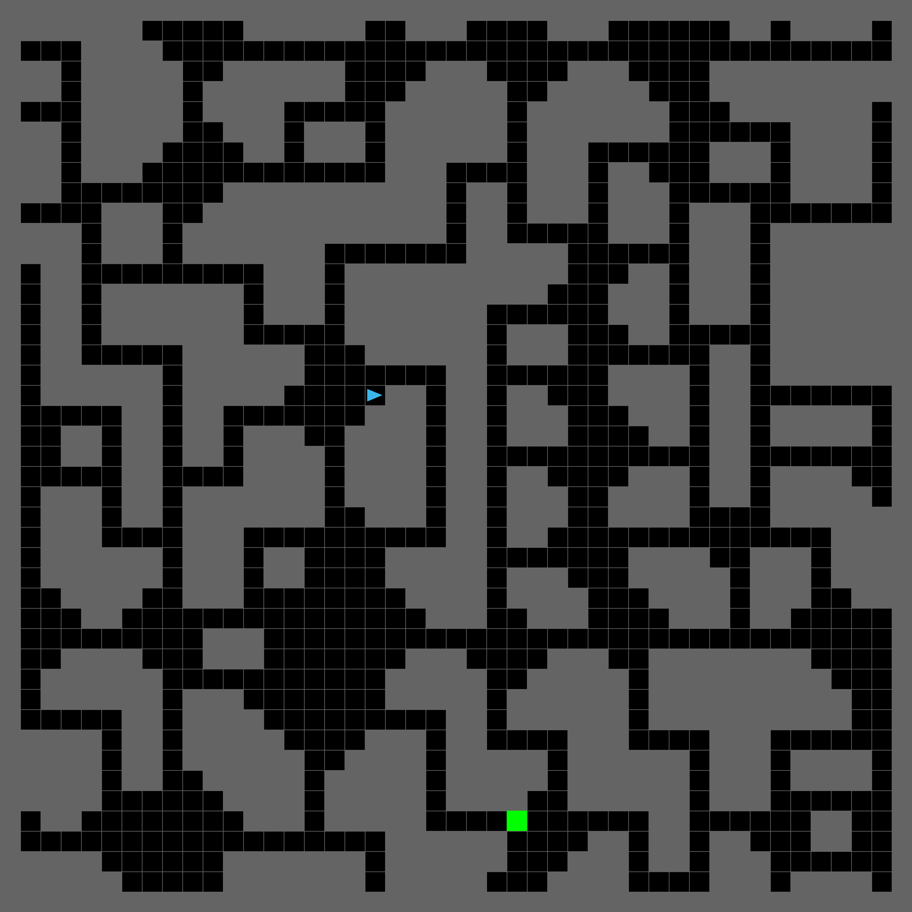
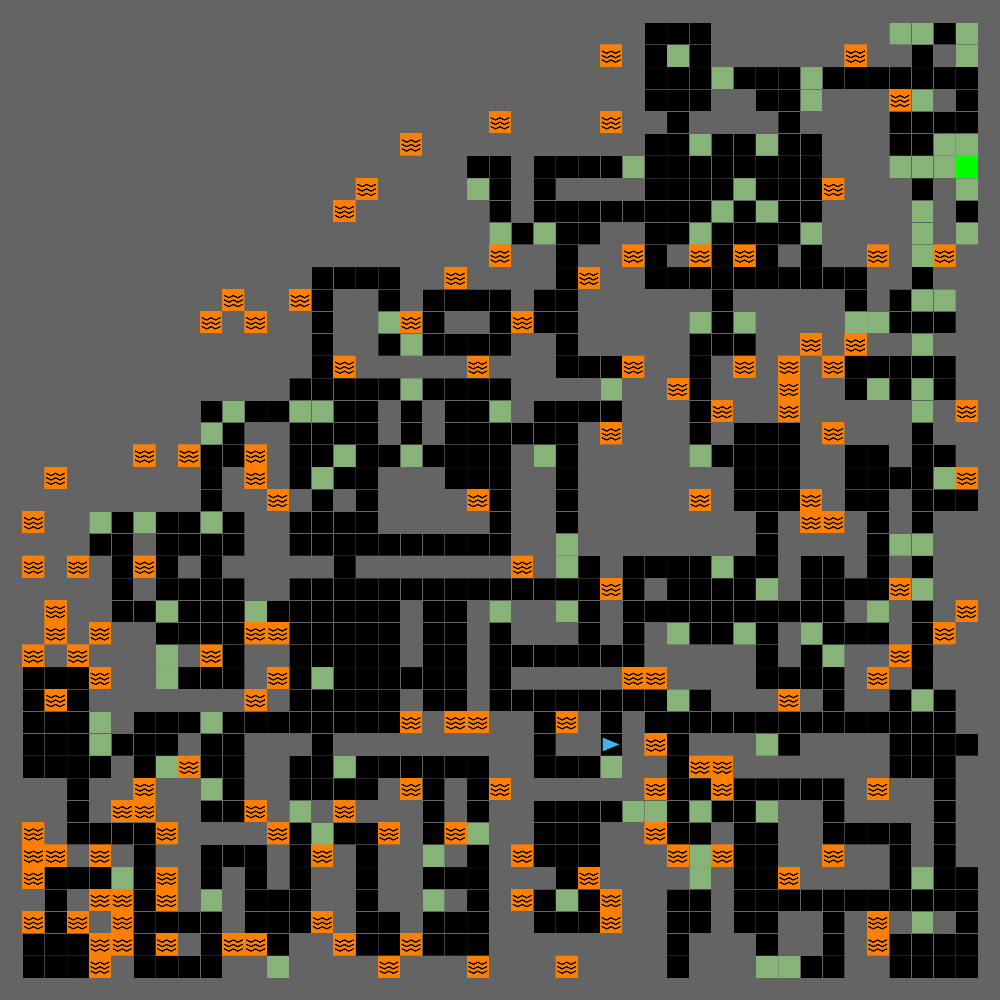
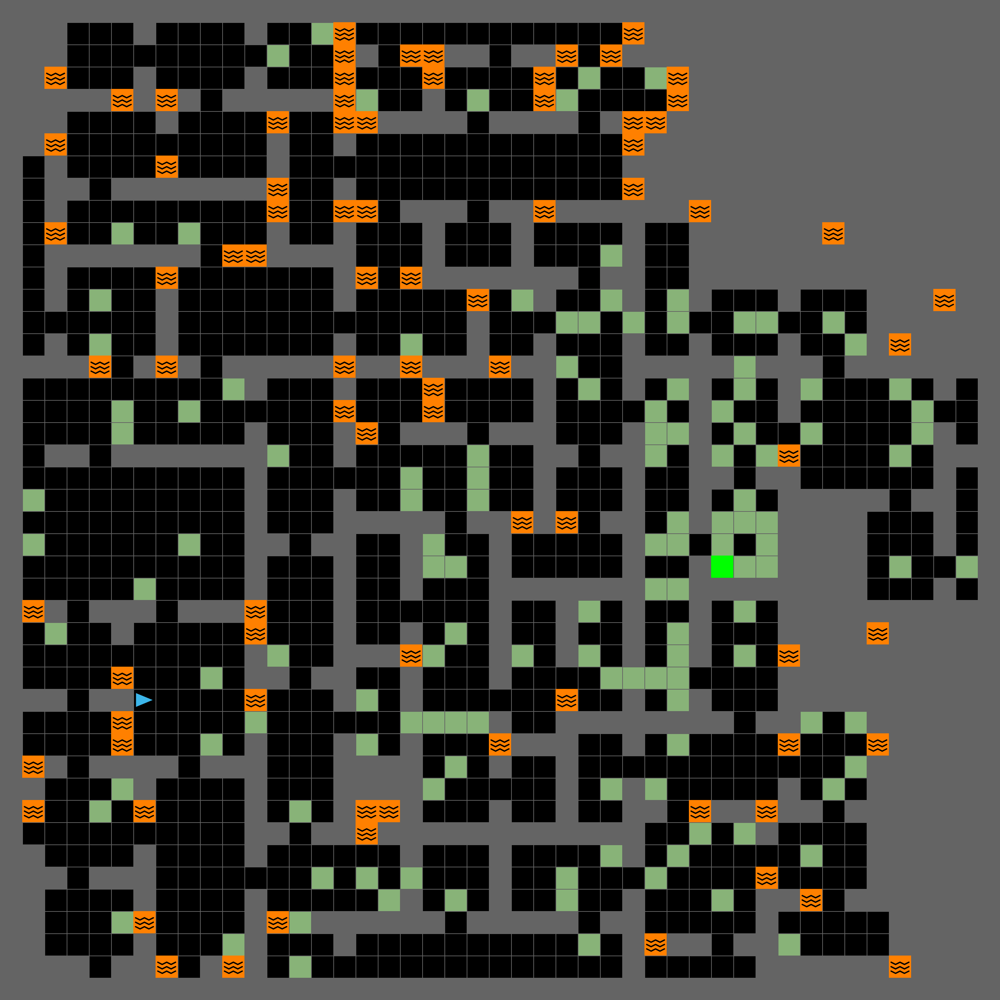
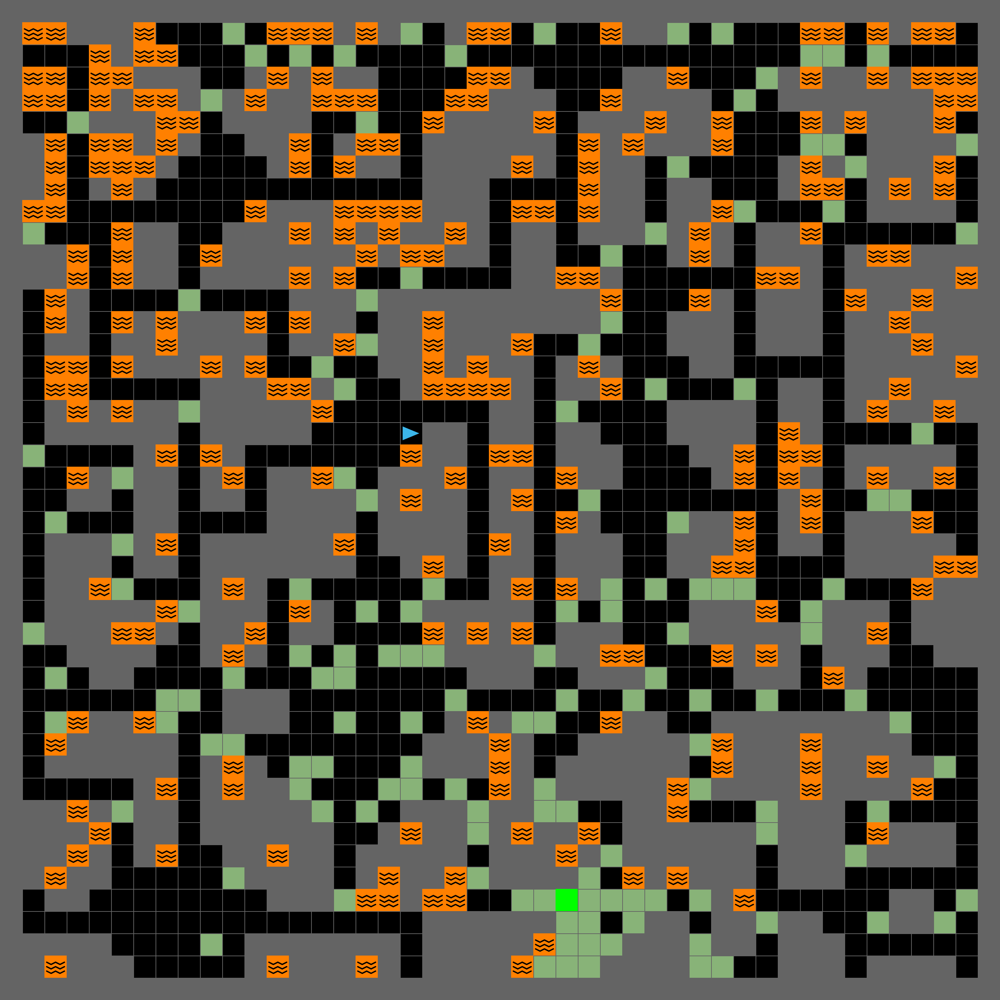

# Data-Regularised Environment Design

This codebase contains a Pytorch implementation of [DRED: Zero-Shot Transfer in Reinforcement Learning via Data-Regularised Environment Design (ICML 2024)](https://arxiv.org/abs/2402.03479). It consists of:
- Implementations for the VAE-DRED and EL-DRED algorithms introduced in the DRED paper. We provide configuration files to reproduce the main experiments in the paper.
- A customisable and extensible framework for specifying and generating large datasets of diverse [MiniGrid](https://minigrid.farama.org/) environments. These environments are procedurally generated using the [Wave Function Collapse](https://github.com/mxgmn/WaveFunctionCollapse) algorithm.
- Implementation of a Variational AutoEncoder (VAE) which can be trained using the generated datasets, and acts as a generative model of MiniGrid environments in DRED.
- Implementations of various Unsupervised Environment Design (UED) algorithms, reproduced from the [Dual Curriculum Design (DCD)](https://github.com/facebookresearch/dcd) repository.

This codebase is designed to be extensible, allowing for easy integration of new environments, generative models and DRED algorithms.

## Citation
If you use this code to develop your own DRED algorithms, or if you use VAE-DRED, EL-DRED, the MiniGrid dataset generation framework, the provided VAE implementation, or the `CaveEscape` and `Dataset` Minigrid environments in academic contexts, please cite 

    Garcin et al, "DRED: Zero-Shot Transfer in Reinforcement Learning via Data-Regularised Environment Design", 2024.
([Bibtex here](https://raw.githubusercontent.com/francelico/dred/main/docs/bibtex/dred.bib))

If you use the reproduced UED algorithms or any environment not mentioned above, please refer to the [citation guidelines](https://github.com/facebookresearch/dcd?tab=readme-ov-file#citation) in the DCD repository.

## Setup
To install the necessary dependencies, run the following commands:
```
git clone https://github.com/uoe-agents/dred.git
cd dred
conda create -n dred python=3.8
conda activate dred
conda install cudatoolkit=11.3 -c pytorch
conda install -c dglteam dgl-cuda11.3
pip install -r requirements.txt
git clone https://github.com/openai/baselines.git
cd baselines
pip install -e .
pip install pyglet==1.5.11 numpy==1.23.4
```

Then, you may either download MiniGrid datasets and a pre-trained VAE model from the DRED [data repository](TODO) or install additional dependencies to generate the datasets and train the VAE yourself.

### Downloading datasets and pre-trained models
- Download the pre-trained VAE model from [X](TODO) and place it in the `dred_pretrained_models` directory.
- Download relevant MiniGrid datasets from [X](TODO) and place them in the `datasets` directory.

### Additional setup for generating datasets and training the VAE
The following command will install additional dependencies for generating datasets and training the VAE:
```
cd minigrid_level_generation/data_generation/generation_algorithms
git clone https://github.com/francelico/wfc_2019f.git
pip install -r requirements-extra.txt
```

### Testing your installation

#### Testing dataset generation and VAE pre-training

You can test dataset generation from scratch by running the following command:
```
python -m minigrid_dataset_generation models=data_generation +data_generation=cave_escape_8_4ts_varp_from_scratch 
+multiprocessing=1
```
To test dataset generation from a dataset pre-generated layouts, download the `minigrid_dense_graph_1M` dataset and place it in the `datasets` directory. Then, run the following command:
```
python -m minigrid_dataset_generation models=data_generation +data_generation=cave_escape_8_4ts_varp 
+multiprocessing=1
```
You can test VAE pre-training with
```
python -m pretrain_generative_model run_name=test_vae_pretraining dataset=cave_escape_8_4ts_varp 
model=res_graphVAE_ce.yaml accelerator=gpu epochs=1 run_post_training_eval=False
```

#### Testing the RL training pipeline with VAE-DRED
If you did not do so already, download the `cave_escape_8_4ts_varp` dataset and the pre-trained VAE model and place them in the appropriate directories. 

`train_scripts/grid_configs/minigrid/cave_escape/test_vae_dred.json` contains a test configuration for VAE-DRED that should complete in less than 5 minutes on a GPU-equipped laptop. You can generate the command to run this test configuration with
```
eval `python train_scripts/make_cmd.py --json minigrid/cave_escape/test_vae_dred.json --no_linebreaks --num_trials 1`
```

## Training agents using DRED with [`train.py`](https://github.com/uoe-agents/dred/blob/master/train.py)

### Choosing a DRED algorithm

### Command-line arguments

The VAE-DRED and EL-DRED algorithms are specified by the following command-line arguments:

| Argument                                   | VAE-DRED            | EL-DRED             |
|--------------------------------------------|:--------------------|:--------------------|
| `ued_algo`                                 | `dred`              | `dred`              |
| `use_dataset`                              | `true`              | `true`              |
| `level_replay_strategy_support`            | `dataset_levels`    | `dataset_levels`    |
| `level_replay_secondary_strategy`          | `grounded_value_l1` | `grounded_value_l1` |
| `level_replay_secondary_strategy_support`  | `buffer`            | `buffer`            |
| `level_replay_secondary_strategy_coef_end` | `1.0`               | `1.0`               |
| `level_replay_schedule`                    | `fixed`             | `fixed`             |
| `ued_editor`                               | `true`              | `true`              |
| `level_editor_method`                      | `generative_model`  | `random`            |

Note that a valid path to a MiniGrid dataset must be specified using the `dataset_path` argument. For VAE-DRED, a valid path to a VAE model checkpoint must also be provided using the `generative_model_path` argument. 

You may also generate the full combination of command-line arguments using provided JSON configuration files in `train_scripts/grid_configs/minigrid/cave_escape`. To obtain the command that launches 1 run described by the relevant configuration file `config.json`, run the command below:
```shell
python train_scripts/make_cmd.py --json config --num_trials 1
```

Alternatively, you can run the following to copy the command directly to your clipboard:
```shell
python train_scripts/make_cmd.py --json config --num_trials 1 | pbcopy
```

Use these configuration files to reproduce experiments from [Garcin et al, 2024](https://arxiv.org/abs/2402.03479):

| Method                                      | json config                      |
|---------------------------------------------|:---------------------------------|
| VAE-DRED                                    | `mg_ce_dataset_vae_dred.json`    | 
| EL-DRED                                     | `mg_ce_dataset_el_dred.json`     |
| $\mathcal{U}$ (Uniform sampling)            | `mg_ce_dataset_uni.json`         |
| PLR                                         | `mg_ce_dataset_plr.json`         |
| ACCEL                                       | `mg_ce_60b_uni_accel_empty.json` |
| ACCEL-D (ACCEL with dataset initialisation) | `mg_ce_dataset_accel.json`       |
| RPLR                                        | `mg_ce_60b_uni_robust_plr.json`  |
| DR                                          | `mg_ce_60b_uni_dr.json`          |


### Logging
By default, `train.py` generates a folder in the directory specified by the `--log_dir` argument, named according to `--xpid`. This folder contains the main training logs, `logs.csv`, and periodic screenshots of generated levels in the directory `screenshots`. Each screenshot uses the naming convention `update_<number of PPO updates>.png`. When `--use_editor` is provided (i.e. for VAE-DRED, EL-DRED or ACCEL), the screenshot naming convention also includes information about whether the original level was obtained from the replay buffer and how many editing cycles led to this level.

### Checkpointing
**Latest checkpoint**
The latest model checkpoint is saved as `model.tar`. The model is checkpointed every `--checkpoint_interval` number of updates. When setting `--checkpoint_basis=num_updates` (default), the checkpoint interval corresponds to the number of rollout cycles (which includes one rollout for each student and teacher). Otherwise, when `--checkpoint_basis=student_grad_updates`, the checkpoint interval corresponds to the number of PPO updates performed by the student agent only. This latter checkpoint basis allows comparing methods based on number of gradient updates actually performed by the student agent, which can differ from number of rollout cycles, as student gradient updates are not performed every rollout cycle in DRED. This is also the case for UED algorithms such as Robust PLR or ACCEL.

**Archived checkpoints**
Separate archived model checkpoints can be saved at specific intervals by specifying a positive value for the argument `--archive_interval`. For example, setting `--archive_interval=1250` and `--checkpoint_basis=student_grad_updates` will result in saving model checkpoints named `model_1250.tar`, `model_2500.tar`, and so on. These archived models are saved in addition to `model.tar`, which always stores the latest checkpoint, based on `--checkpoint_interval`.

## Generating MiniGrid datasets with [`minigrid_dataset_generation.py`](https://github.com/uoe-agents/dred/blob/master/minigrid_dataset_generation.py)

We provide a framework for procedurally generating large datasets of diverse MiniGrid environments with specifiable 
semantics. Dataset are stored in the `datasets` directory. Each dataset is stored in a separate directory, with the dataset name corresponding to the name of the YAML configuration file used to generate it. The dataset directory contains the following files:
- `dataset.meta` : metadata file containing information about the dataset
- `batch_X.data`/`test_batch_X.data`: files containing batches of levels from the train or test subsets, encoded as DGL graphs.
- `batch_X.data.meta`/`test_batch_X.data.meta`: metadata files containing information about their corresponding batch files, including each level graph re-encoded as numpy arrays directly compatible with MiniGrid.
- `batch_X.data.dgl.extra`/`test_batch_X.data.dgl.extra`: additional batch metadata encoded as DGL graphs. This metadata is stored separately from the rest of the metadata for storage efficiency reasons.
- `layouts.png`: rendering of sampled levels from the dataset.

The dataset generation process is controlled via YAML configuration files in 
`minigrid_level_generation/conf/data_generation`. To generate a dataset described by a configuration file `config.yaml`, run the following command:
```shell
python -m minigrid_dataset_generation models=data_generation +data_generation=config
```

For each environment being generated, the generation process takes place in two stages:
1. **Layout generation**: The layout of the environment is generated using the [Wave Function Collapse (WFC) algorithm](https://github.com/mxgmn/WaveFunctionCollapse).
2. **Addition of objects and tiles**: The layout is populated with objects and tiles, following a distribution specified by the user. This distribution can be designed to create shared semantics across environments in the dataset.
We provide a brief overview of each stage below, and recommend reading comments in 
   `cave_escape_8_4ts_varp_from_scratch.yaml` for a detailed explanation of the generation parameters.

### Layout generation with WFC
WFC allows to transform a single basic initial template into a multitude of diverse and complex layouts, as can be 
seen in the examples below.

| Task Structure | Template                                                                                                 | Example 15x15 generated layout                                                                | Example 45x45 generated layout                                                                |
|----------------|:---------------------------------------------------------------------------------------------------------|:----------------------------------------------------------------------------------------------|:----------------------------------------------------------------------------------------------|
| `dungeon_`     |  |           |           |
| `rooms_office` |       |  |  |
| `skew_2`       |        |              |              |

We provide templates and WFC parameter configurations to generate 22 different task structures. You can select the 
mix of task structures you would like to generate by specifying the `task_structure_split` parameter in the YAML 
configuration file.

You can also define additional task structures by adding new templates to 
`minigrid_level_generation/data_generation/templates` and YAML configuration files to `minigrid_level_generation/conf/task_structure`.

### Addition of objects and tiles to create common semantics across environments
Each layout can be populated with MiniGrid objects and tiles according to tile distributions specified by the user. 
Currently, only moss (encoded as floor tiles) and lava tiles are supported through the `lava_distribution_params` 
and `moss_distribution_params` parameters in the YAML configuration file, but the generation 
framework can 
easily be 
extended to 
support 
additional 
object types.

Specifying these distributions contributes to the creation of shared semantics across environments in the dataset. 
For example the "Cave Escape" layouts below are designed to have moss tiles in the vicinity of the goal, and lava 
tiles far
    from the goal.

| Base layout                                                                                   | Cave escape layout                                                                    |
|:----------------------------------------------------------------------------------------------|:--------------------------------------------------------------------------------------|
|           |           
|   |  |
|              |              |


### Faster dataset generation
WFC procedural generation is computationally expensive. To speed up the generation process, we provide the option to:
1. **enable multiprocessing**: add `+multiprocessing=1 num_cpus=N` to the command line arguments to generate the 
   dataset 
   batches 
   using `N` parallel processes.
2. **use pre-generated layouts**: you may skip the WFC layout generation step by bootstrapping from an existing 
   dataset. We provide 
   `minigrid_dense_graph_1M`, a dataset of 1.5M pre-generated 15x15 layouts of diverse 
   task structures that is 
   available for 
   download from [X](TODO). After placing this dataset in the `datasets` directory, you can use it do generate new 
   datasets 
   by specifying the `source_dataset`, `train_batch_ids` and `test_batch_ids` arguments in the YAML 
   configuration file (you can refer to `batch_info.csv` in the `minigrid_dense_graph_1M` directory for a breakdown 
   of which task structures are found in different batch files). See 
   `cave_escape_8_4ts_varp.yaml` for an example configuration file using pre-generated layouts.

## Pre-training the VAE on a MiniGrid dataset with [`pretrain_generative_model.py`](https://github.com/uoe-agents/dred/blob/master/pretrain_generative_model.py)

Run the following command pretrain the generative model used in [Garcin et al, 2024](https://arxiv.org/abs/2402.03479)

```shell
python -m pretrain_generative_model run_name=pretrain_generative_model model=res_graphVAE_ce.yaml 
dataset=cave_escape_512_4ts_varp 
accelerator=gpu epochs=200 run_post_training_eval=False
```

## Evaluating RL agents on generated datasets with [`eval_dataset.py`](https://github.com/uoe-agents/dred/blob/master/eval_dataset.py)

To use [`eval.py`](https://github.com/uoe-agents/dred/blob/master/eval.py) the reader to the [DCD repository](https://github.com/facebookresearch/dcd?tab=readme-ov-file#evaluating-agents-with-evalpy)

### Evaluating agents with [`eval.py`](https://github.com/uoe-agents/dred/blob/master/eval.py)

#### Evaluating a single model
The following command evaluates a `<model>.tar` in an experiment results directory, `<xpid>`, located in a base log 
output 
directory `<log_dir>`. It will evaluate the agent in datasets `<dataset_name1>`, 
`<dataset_name2>`, 
and `<dataset_name3>`, running one evaluation episode per environment in each dataset. It will output the results in 
a .csv named `<output file prefix><model>.csv' located in `<result_dir>`.
```shell
python -m eval_dataset \
--base_path=<log dir> \
--result_filename_prefix=<output file prefix> \
--result_path=<output dir> \
--xpid=<xpid> \
--datasets_root=<datasets dir> \
--datasets=<dataset_name1>,<dataset_name2>,<dataset_name3> \
--model_tar=<model>
```

#### Evaluating a specific model checkpoint across multiple runs
the following command evaluates a `<model>.tar` in experiment results directories 
matching the prefix 
`<xpid_prefix>`. This prefix argument is useful for evaluating models from a set of training runs with the same 
hyperparameter settings.
```shell
python -m eval_dataset \
--base_path=<log dir> \
--result_filename_prefix=<output file prefix> \
--result_path=<output dir> \
--prefix=<xpid_prefix> \
--datasets_root=<datasets dir> \
--datasets=<dataset_name1>,<dataset_name2>,<dataset_name3> \
--model_tar=<model>
```

#### Evaluating all model checkpoints
The following command evaluates all models (all files ending in `.tar`) in experiment results directories 
matching the prefix 
`<xpid_prefix>`. It is useful to evaluate all model checkpoints saved during training, for a set of training runs. 
It will output results in multiple .csv files, one for each model checkpoint.
```shell
python -m eval_dataset \
--base_path=<log dir> \
--result_filename_prefix=<output file prefix> \
--result_path=<output dir> \
--prefix=<xpid_prefix> \
--datasets_root=<datasets dir> \
--datasets=<dataset_name1>,<dataset_name2>,<dataset_name3> \
--model_tar=all
```

## Additional resources
- [Our data repository](TODO) contains several MiniGrid datasets and the pre-trained VAE model used in [Garcin et al, 2024](https://arxiv.org/abs/2402.03479).
- [Our experiment repository](TODO) contains the model checkpoints, logs and plotting code used to generate figures 
  and tables in [Garcin et 
  al, 2024](https://arxiv.org/abs/2402.03479).
- [The DCD repository](https://github.com/facebookresearch/dcd) contains implementations of various UED algorithms, 
  and was the basis for our implementation of DRED.
- Our WFC-based layout generation was released as part of the official MiniGrid 2.4.0 release and is therefore 
  available in the most recent versions of MiniGrid. See the documentation [here](https://minigrid.farama.org/) 
  (TODO: exact link).
- WFC layout generation uses the [wfc_2019f python implementation](https://github.com/ikarth/wfc_2019f).